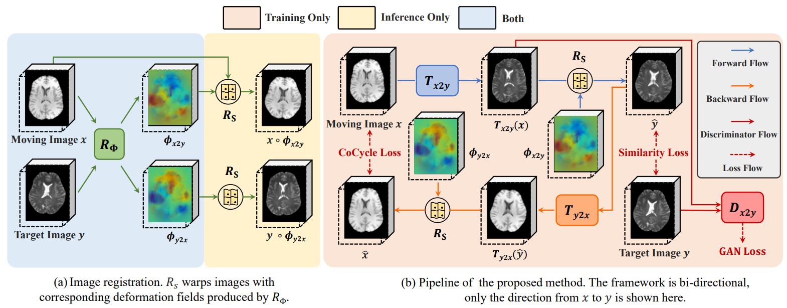

# CoCycleReg
This is the official implementation of the paper CoCycleReg: Collaborative Cycle-consistency Method for Multi-modal Medical Image Registration.

Some code of this repository is borrowed from [Voxelmorph](https://github.com/voxelmorph/voxelmorph) and [NeMAR](https://github.com/moabarar/nemar).

## Getting started
### 1 Requirements

If you are using conda, you can continue with

      conda env create -f environment.yaml

### 2 Data preparation
- Preparing the data for training like

   ├── /the/path/of/training/data/

&ensp;&ensp;&ensp;&ensp;&ensp;&ensp;&ensp;&ensp;├── img1_modality1.npy

&ensp;&ensp;&ensp;&ensp;&ensp;&ensp;&ensp;&ensp;├── img1_modality2.npy

&ensp;&ensp;&ensp;&ensp;&ensp;&ensp;&ensp;&ensp;├── img2_modality1.npy

&ensp;&ensp;&ensp;&ensp;&ensp;&ensp;&ensp;&ensp;├── img2_modality2.npy

&ensp;&ensp;&ensp;&ensp;&ensp;&ensp;&ensp;&ensp;&ensp;&ensp;......

- Preparing the data for validating like

   ├── /the/path/of/validating/data/

&ensp;&ensp;&ensp;&ensp;&ensp;&ensp;&ensp;&ensp;├── img1_modality1.npy

&ensp;&ensp;&ensp;&ensp;&ensp;&ensp;&ensp;&ensp;├── img1_modality2.npy
	
&ensp;&ensp;&ensp;&ensp;&ensp;&ensp;&ensp;&ensp;├── img1_modality1_seg.npy

&ensp;&ensp;&ensp;&ensp;&ensp;&ensp;&ensp;&ensp;├── img1_modality2_seg.npy

&ensp;&ensp;&ensp;&ensp;&ensp;&ensp;&ensp;&ensp;├── img2_modality1.npy

&ensp;&ensp;&ensp;&ensp;&ensp;&ensp;&ensp;&ensp;├── img2_modality2.npy
	
&ensp;&ensp;&ensp;&ensp;&ensp;&ensp;&ensp;&ensp;├── img2_modality1_seg.npy

&ensp;&ensp;&ensp;&ensp;&ensp;&ensp;&ensp;&ensp;├── img2_modality2_seg.npy
	
&ensp;&ensp;&ensp;&ensp;&ensp;&ensp;&ensp;&ensp;&ensp;&ensp;......

### 3 Training

- Set the data path, GPU ID, batch size and other parameters in [config.yaml](/config.yaml).

- Start training by running

      python train.py

- Tensorboard is supported, the log files are in /the/path/of/output/log/.

- The weights are saved in /the/path/of/output/pth/.

# Feedback
If you have any problem, please feel free to report it in the issue, thank you!

